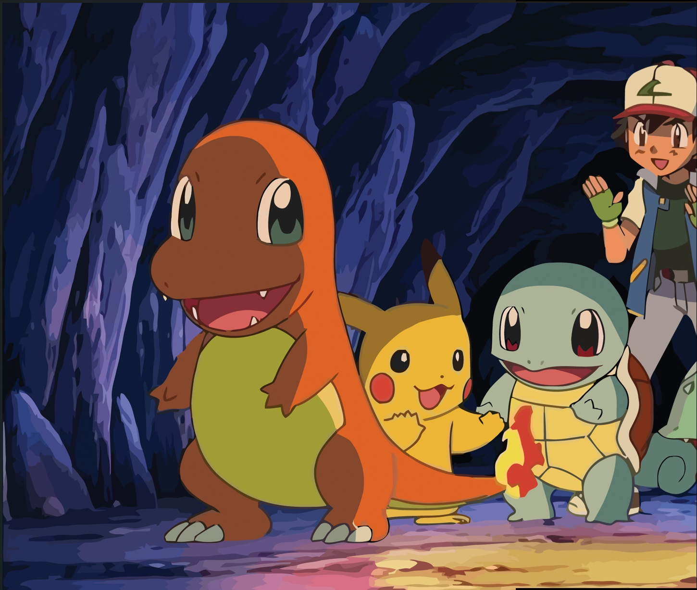

# 🖼️ Panorama Image Stitcher (Flask App)

This is a web-based application that allows users to stitch two overlapping images into a panorama using feature matching algorithms like **SIFT** or **ORB**. Built using **Flask** and **OpenCV**.

---

## 🚀 Features

- Upload two overlapping images.
- Choose between **SIFT** or **ORB** feature descriptors.
- Detect keypoints and compute homography.
- View matched keypoints and the final stitched panorama.
- Download the stitched output image.

---

## 📁 Project Structure

```

panorama/
├── app.py               # Flask backend
├── stitcher.py          # Image stitching logic using OpenCV
├── templates/
│   └── index.html       # Frontend interface
├── static/
│   ├── style.css        # Styling
│   └── output.jpg       # Output image (generated at runtime)
├── uploads/             # Temporary image uploads (auto-cleared)
├── README.md
├── requirements.txt

````

---

## ⚙️ Requirements

- Python 3.7+
- Flask
- OpenCV (`cv2`)
- NumPy

Install all dependencies:

```bash
pip install -r requirements.txt
````

---

## 🏃 How to Run Locally

```bash
python app.py
```

Then open [http://127.0.0.1:5000](http://127.0.0.1:5000) in your browser.

---

## 📦 Packaging as Executable (Optional)

To convert this app to a desktop `.exe` using **PyInstaller**:

```bash
pyinstaller --onefile --add-data "templates;templates" --add-data "static;static" app.py
```

Your standalone executable will appear in the `dist/` folder.

---

## 🌐 Live Deployment (Optional)

You can deploy this project for free on:

* **Render**
* **PythonAnywhere**
* **Replit (limited file support)**

Refer to your platform's setup guide or ask for detailed steps.

---

## 👩‍💻 Developed By

**Alpana Dubey**
📧 [alpanadubey975@gmail.com](mailto:alpanadubey975@gmail.com)

---

## 📸 Example Output


```

---
